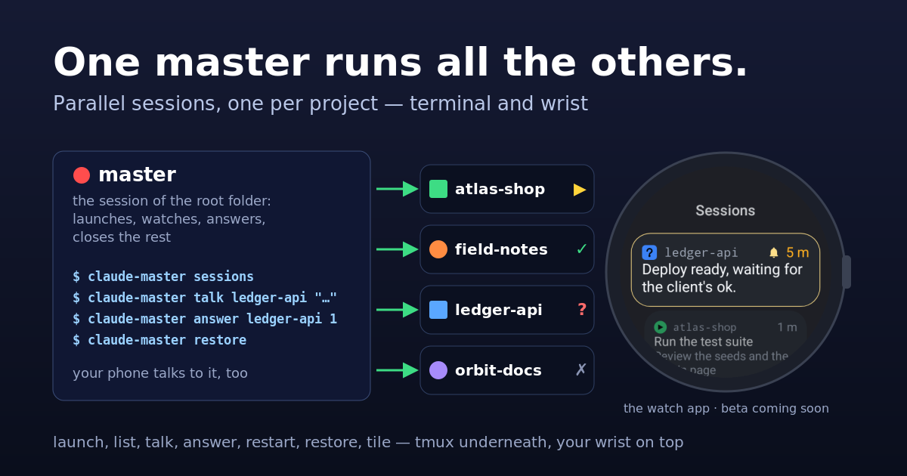
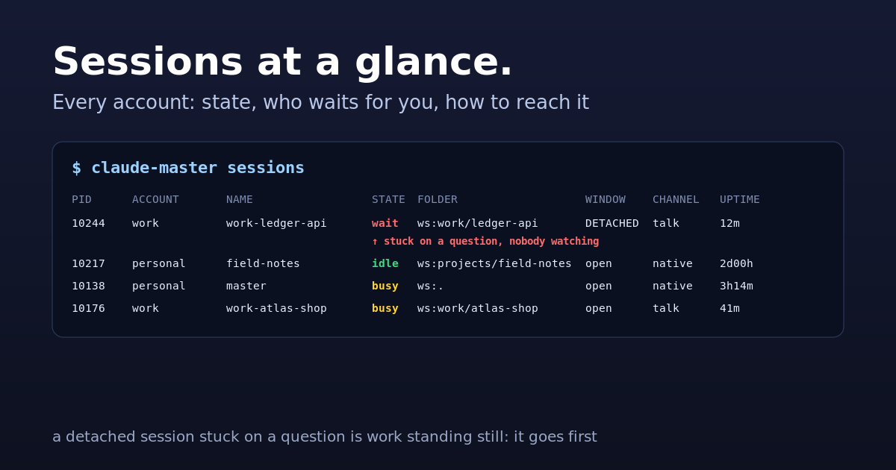
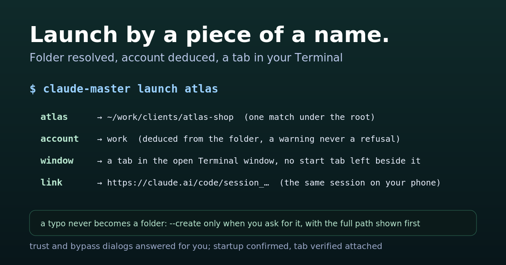
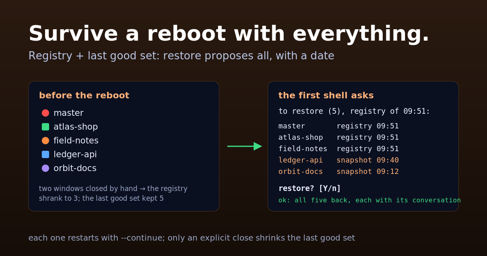
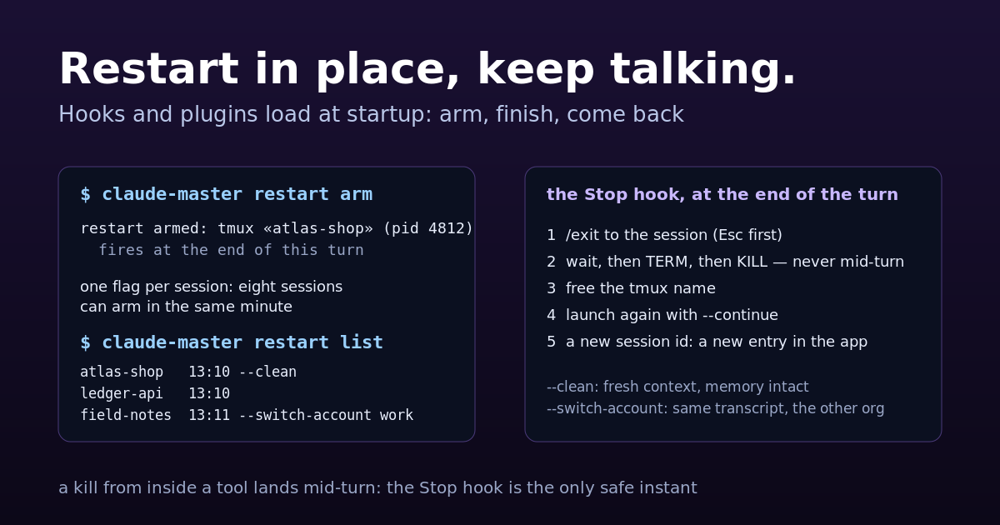
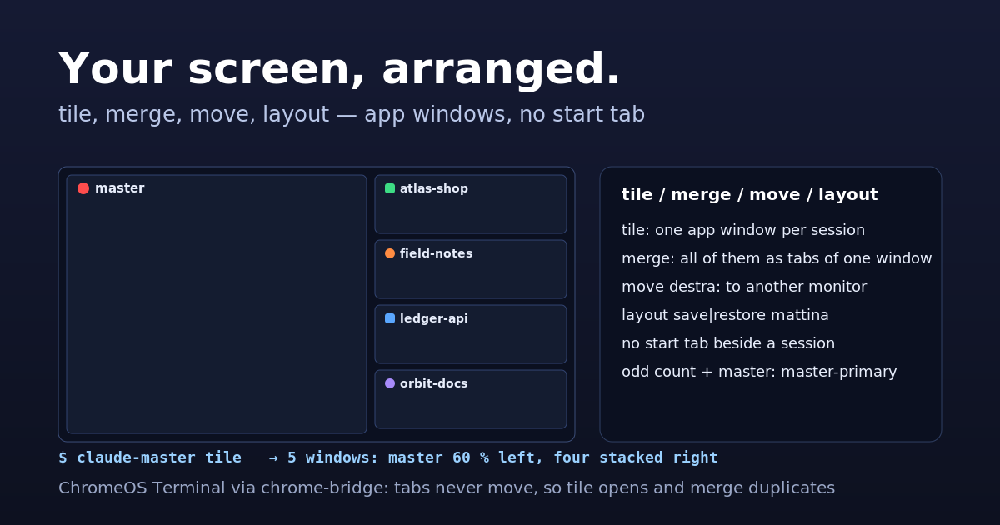
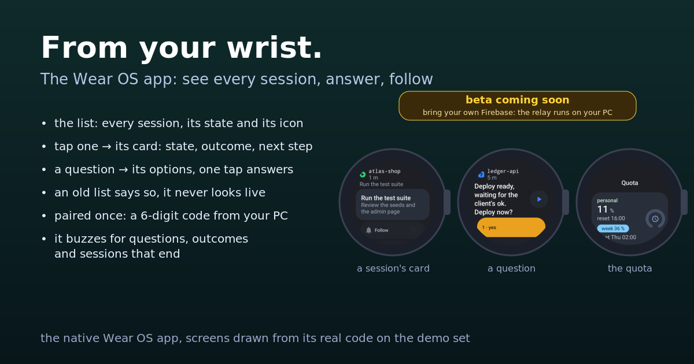
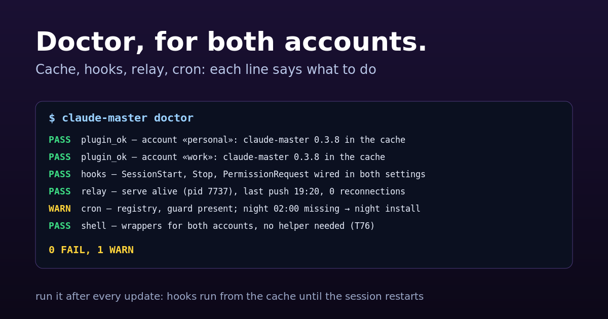

# claude-master

  



**Run several Claude Code sessions on one computer without losing track of
them.** Each project gets its own terminal tab with a name and a colour; one
list shows what is running; you can send a prompt from one session to another,
or from your phone; a restart keeps the conversation; and after a reboot, the
first shell you open offers to bring every session back. One session, the
**master** on your workspace root, runs all the others: it is the one your
phone talks to, and it launches, watches, answers and closes the rest.

**Who it is for, honestly:** people who keep three or more Claude Code sessions
open at once, on one machine, with one or two Claude accounts. If you open one
session at a time, you do not need it. It runs daily on one workstation
(ChromeOS, two accounts, up to eight sessions); the other terminals are
supported in code but not yet tried on real hardware — the table further down
says which.

## Before you start

- Claude Code 2.1.263 or newer, `tmux`, `python3` 3.8+ and `bash` on the PATH.
- A terminal from the list below. On ChromeOS the window commands also need
  [chrome-bridge](https://github.com/frsorrentino/chrome-bridge), a small
  extension-plus-server that lets scripts move Chrome windows.
- Optional, for the phone features: Claude Code's own `telegram` plugin,
  already configured with your bot and your chat.

## Quickstart

```bash
claude plugin marketplace add frsorrentino/claude-master
claude plugin install claude-master@fsorrentino --scope user
claude-master init --dry-run             # reads your machine and shows every value it found, with its source
claude-master init --yes --shim --shell  # writes the config; --shim = the `claude-master` command in ~/.local/bin;
                                         # --shell = the file that makes `claude` open a named tab
claude-master doctor                     # all green, or one line per thing to fix
claude-master launch ~/projects/x        # your first session, in its own tab
```

`init --shell` prints one line to add to your `.bashrc` or `.zshrc`. From then
on, typing `claude` in a project folder opens that project's session in a
named, coloured tab instead of an anonymous window. To undo everything:
`claude plugin uninstall claude-master`, remove that line, and
`claude-master bot uninstall` / `diary uninstall` / `night uninstall` if you had
turned those on.

## What you get

Every function has a card; every card has a function behind it. The sessions
in the pictures (`master`, `atlas-shop`, `ledger-api`, `field-notes`, `orbit-docs`) are a demo set.

### Sessions at a glance



`claude-master sessions` lists every session of every account: busy, idle, or
stopped on a question waiting for you, whether a tab is attached, which
channel reaches it. A detached session stuck on a question is work standing
still, not work in progress: it goes first. `claude-master next` picks the one
that needs you most.

### Launch by a piece of a name



`claude-master launch atlas` resolves the folder under your workspace root,
deduces the account (personal or work, by a map you set once: a warning, never
a refusal), answers the trust and bypass dialogs, and opens the session as a
tab of the Terminal window you already have, with no start tab beside it. A
typo never becomes a folder: `--create` only when you ask, with the full path
shown first. Typing `claude` inside a project folder does the same.

### Talk. Answer its question.


`claude-master talk ledger-api "deploy done?"` delivers a prompt to another
session, on either account, and reads the answer back from its transcript.
`claude-master answer ledger-api --show` reads the question a session is stuck on,
options numbered; `answer ledger-api 1` answers it: a message in the inbox never
unblocks a dialog, this does. The phone gets the same question with its
options as buttons the moment the session stops.

### Survive a reboot with everything



The first shell after a reboot offers to bring every session back, each with
its own conversation. Two lists feed it: the registry, reconciled every five
minutes, and the «last good set», which grows with the sessions and never
shrinks on its own — two windows closed by hand before the reboot cannot make
a session disappear from the proposal. `claude-master restore --dry-run` shows
what would come back, with the source and the date of each.

### Restart in place, keep talking



`claude-master restart arm` restarts the current session when its turn ends
and resumes where it was, because hooks, settings and plugins are read at
startup only. One flag per session, so eight sessions can arm in the same
minute; `restart list` shows them. `--clean` starts fresh with the memory
intact, `--switch-account` continues the same conversation on the other
account. A kill from inside a tool would land mid-turn: the hook is the only
safe instant.

### Your screen, arranged



On ChromeOS, `claude-master tile` gives every session an app window of its
own and arranges them: equal columns, a grid when they get narrow, and with an
odd count that includes the master, the master big on the left and the others
stacked on the right. `merge` brings them back as tabs of one window, `move
destra` sends them to another monitor, `layout save mattina` remembers a
layout. The Terminal's start tab is evicted, never left beside a session.

### From your wrist



The Telegram bot is written for a watch: every message is a few whole lines
(the bubble is as wide as its longest line, so nothing is wrapped or cut at a
fixed width), every command is a bare, dictable word (`sessioni`,
`lancia ledger`, `avvisami`, `continua`, `ferma`), and the buttons are
contextual — verbs for actions (Avvisami, Continua, Ferma, Leggi tutto,
Annulla modifiche), nouns for destinations (Sessioni, Terminale, «◀ name»).
The list is one button per session; a tap opens the card (state, last
outcome, «→ next» from the recap, the open question with its options as
buttons); a number, «due si» or a tap answers it through `answer`, after a
git checkpoint of the workspace that «Annulla modifiche» restores. Free text
in a card is a prompt for that session, and the feedback matches the desktop:
one live message («📤 name» + your words) that edits itself from the
session's transcript while it works — «▶ name working», the tool in use, the
last lines it wrote, «❓ name waits for you» — with Ferma (Esc) and Terminale
under it, «⚠ name did not receive» + Invia di nuovo when the prompt never
shows up; then a new message «✓ name» with the one line the session wrote
for the watch (the prompt asks it to end with `Watch: <outcome ≤ 60 chars>`;
Leggi tutto for the rest). Silent, except questions, outcomes, answers, errors
and vanished sessions.

Wear OS tested; watchOS via Telegram notifications and dictation, not yet
verified.

### Relay for the Wear OS app

`claude-master relay` puts the PC on the bus of the native watch app
(`personali/claude-master-watch`, design in `docs/plans/2026-09-12-app-polso-design.md`):
`relay push` publishes an encrypted `/state` (the v1 contract in
`tests/fixtures/relay/`) to Firebase RTDB, appends `/events` and wakes the watch
with FCM; `relay serve` listens on `/cmd` and runs the allow-listed commands
(answer, prompt, launch, follow, resume, screen, allow_all) through the CLI,
writing `/result`; `relay pair` shows a six-digit code and agrees the AES key
with the watch over X25519. Setup: a Firebase project with RTDB and FCM, its
service account JSON in `~/.claude-master/relay/service-account.json` (0600,
never in the repo), `relay.enabled`, `relay.firebase_url` and `relay.fcm_topic`
in the config, then `relay pair`, `relay install`. RTDB rules: `/state`,
`/events` and `/result` readable only by a uid present in `/allowed`, `/cmd`
writable only by those, `/pair/<code>/watch` writable by an anonymous user; the
PC writes with the service account. `relay push --dry-run` prints the clear
state without touching the network.

Each session in `/state` carries the badge the watch draws: `icon`, the emoji
of its Terminal tab (stable for the session's life, the last known one once it
is gone), and `color`, the hue alone as `#RRGGBB` whatever the shape — the
watch takes the shape from the account (round for the personal one, square for
the others) and the colour from here, so a session looks the same on the PC, in
Telegram and on the wrist. `relay.colors` overrides the emoji-to-hex map.

### Guard, diary, digest, night


`claude-master guard` warns once per window when an account passes 95 % of
its quota and, at the reset, sends «resume where you were» to the sessions
that hit the wall. At 20:00 the recap: one sentence per project on what was
done and the next step, the ones waiting on a question first, the same line
appended to the project's `docs/recap.md`. At 08:00 the digest: what waits for
you. At 02:00 the night queue runs one job at a time, only while free memory
and quota allow, leaving a report in the project.

### Doctor, for both accounts



`claude-master doctor` checks both accounts: the plugin in the cache at the
right version, the hooks wired in, the bot's daemon alive, the cron lines
present; each line says what to do. Run it after every update: hooks run
from the cache, and a live session keeps its old version until it restarts.

**Why not plain tmux?** tmux keeps sessions alive; it does not know which
Claude account a folder belongs to, which session is waiting on a question,
how to ask another session something and read the answer, or how to bring
eight conversations back after a reboot. That is the part this plugin adds,
on top of tmux, not instead of it.

## What it does

Ten commands cover a normal day; the complete reference is at the end.

| you want to… | you type |
|---|---|
| open a session on a project | `claude-master launch <folder>` (or just `claude` inside it) |
| see everything running | `claude-master sessions` |
| find what needs you | `claude-master next` |
| talk to another session | `claude-master talk <name> "…"` |
| answer the question another session is stuck on | `claude-master answer <name> --show` · `answer <name> 2` (Telegram tells you the options when it stops) |
| see what a session is doing, from the phone | `claude-master screen <name>` |
| close one | `claude-master close <name>` (refuses one with a tab attached: close the tab instead) |
| restart this one, keep the conversation | `claude-master restart arm` · `restart list` |
| send a screenshot to a project | `claude-master report <project> <image> "…"` |
| get everything back after a reboot | `claude-master restore` (the shell offers it) |
| arrange the windows | `claude-master tile` · `merge` · `move destra` · `layout save mattina` |
| put a session to sleep, wake it later | `claude-master park <name>` · `unpark <name>` |

Inside a session the same things are slash commands (`/claude-master:sessions`,
`:launch`, `:close`, `:restart`, `:report`, `:quota`), and a short set of rules
is loaded at every start so the agent knows how to resolve a half-typed folder
name, that it may create a folder only if you asked, and how to reach another
session.

## What you are trusting

Three things are worth knowing before you turn them on.

- **Sessions start with `--dangerously-skip-permissions`** if `init` sees that
  your existing sessions use it (it says so, with the source). That is what
  lets a session work unattended, restart itself, or answer another session
  without a human pressing "allow". Without it a session cannot run commands
  at all. Remove it from `session.claude_args` if you want the permission
  prompts back.
- **`crossSessionInbound: accept`** in an account's settings lets another
  session on this machine send prompts to that account's sessions. It is
  needed only for `talk` across accounts, and it means: whoever can run
  commands on this machine can talk to those sessions.
- **The Telegram bot** answers only chats already in the `telegram` plugin's
  allow list, discards its backlog on the first run so an old message cannot
  start anything, and takes a git checkpoint of a session's workspace before
  a «yes» from the watch reaches it (`annulla` restores it).

Each session is a Claude Code process (a few hundred MB each); the only
process the plugin adds is the bot's daemon, a few MB waiting on a socket;
the diary, the digest and the night queue are scheduled tasks that run for
seconds.

## How it works

Every session is a `tmux` session named after its folder, started with Claude
Code's *Remote Control* (the feature that shows a session in the Claude app on
your phone and lets you drive it from there), so it appears there under the
same name. The plugin reads the session registry Claude Code already keeps
(`~/.claude/sessions/`, one per account) and talks to a session through the
inbox socket Claude Code already opens. Six small *hooks* (actions Claude Code
runs at events: a session starts or ends, a turn ends, a permission is asked)
keep the list fresh, stamp the local time on every prompt, deliver queued
prompts, and run the restart you armed. State lives in one folder, the
configuration in one JSON file, and every value in it was read from your
machine by `init`, with defaults only where nothing was found.

## Configuration

One file for the whole machine, `~/.config/claude-master/config.json`, written
by `claude-master init` from what it finds: your accounts and their folders,
the workspace root, the terminal you use, the language of the messages. You
rarely touch it; when you do, `claude-master doctor` tells you if something no
longer adds up. A minimal example for two accounts:

```json
{
  "workspace": {"root": "~/Desktop/workspaces"},
  "accounts": {
    "personal": {"config_dir": "~/.claude", "shell_command": "claude"},
    "work":     {"config_dir": "~/.claude-work", "tmux_prefix": "w-", "shell_command": "claude-work"}
  },
  "default_account": "personal",
  "folder_map": [{"path": "~/Desktop/workspaces/clients", "account": "work"}],
  "session": {"claude_args": ["--dangerously-skip-permissions"]},
  "terminal": {"backend": "chromeos"}
}
```

| key | what it decides |
|---|---|
| `accounts.<name>` | one entry per Claude account: its config folder, the tab's shape, a prefix for its session names, the shell command that opens it |
| `folder_map` · `workspace.root` | which folders belong to which account; the root opens the `master` session |
| `session.claude_args` · `session.link_wait_s` | flags every session starts with; how long `launch` waits for the Remote Control link (20 s) |
| `terminal.backend` | `chromeos`, `gnome`, `kitty`, `iterm2`, `macos-terminal`, `wt`, `none` |
| `shell.*` · `tmux.keybindings` · `tile.*` | the wrappers and aliases `init --shell` generates, the three keys of the `.tmux.conf` block, the window layout rules |
| `bot.*` · `recap.*` · `night.*` · `guard.*` | the Telegram bot, the evening diary, the night queue: all off or empty until you turn them on |
| `language` | `it` or `en` |

The full list with defaults: [`claude-master/config.example.json`](claude-master/config.example.json).

## From the phone and from the wrist

`claude-master bot serve` is a small long-polling daemon on the same Telegram
bot as Claude Code's `telegram` plugin (same token, same allowed chats); the
once-a-minute task only restarts it if it died. It is the only consumer of
the bot: keep the plugin's own poller off, or `serve` steps aside and says so.
`/sessions full` keeps the desktop table; everything else is sized for a
watch, as the card above shows. `bot digest` at 08:00, `recap` at 20:00 and
`night` at 02:00 use the same chats.

```bash
# config.json: "bot": {"enabled": true}
claude-master bot install      # the daemon, its once-a-minute keeper and the 08:00 digest; `bot status` shows who is listening
claude-master recap install    # the day's diary to the same chats at 20:00 (recap.cron_time)
claude-master night install    # the overnight queue at 02:00 (night.cron_time); fill it with `night add`
```

Two limits, stated plainly. After a **reboot** nobody is logged in and
scheduled tasks do not run: the bot covers «sessions closed, machine awake»,
not «machine off» — on a Chromebook, set the power options so the machine does
not sleep while charging. And the diary reports *what happened*, not what it
cost: costs stay where they are measured (for me, fable-director).

## Terminal backends

| backend | tried on real hardware | notes |
|---|---|---|
| `chromeos` | **yes**, daily | ChromeOS Terminal; tabs, colours, `tile`/`merge`/`move`/`layout` |
| `none` | yes | no tab: sessions live in tmux, `tmux attach -t =<name>` |
| `gnome` | no | `gnome-terminal --tab`; written from the docs, covered only by tests with a fake terminal |
| `kitty` | no | same |
| `iterm2` · `macos-terminal` | no | same, through AppleScript |
| `wt` | no | Windows Terminal, from a Linux shell under WSL; same |

On an untried backend the first launch is the test: `launch` says whether the
tab attached and, if it did not, prints the `tmux attach` line so nothing is
lost. If it fails, `terminal.backend: none` keeps everything else working.
Arranging windows exists only on ChromeOS through chrome-bridge, and Chrome
only sees a monitor that has a window on it: `move` tells you to drag one there.

## Requirements

- tmux (tested with 3.3a), python3 ≥ 3.8, bash; Claude Code ≥ 2.1.263.
- `crossSessionInbound: accept` in an account's settings, only to receive
  `talk` from the other account.
- chrome-bridge ≥ 1.16.1, only for the window commands on ChromeOS.
- Claude Code's `telegram` plugin, only for the bot, the diary and the night
  summary.

## Commands

The complete reference. Italian aliases (`lancia`, `chiudi`, `sessioni`,
`affianca`…) come from `init --shell`; every flag accepts both spellings
(`--crea`/`--create`, `--prova`/`--dry-run`).

| command | what it does |
|---|---|
| `claude-master init [--dry-run\|--yes] [--force] [--shim] [--shell] [--cron] [--tmux]` | reads the machine and proposes or writes the configuration; the flags print (or install with `--yes`) the shim, the shell file, the crontab line, the `.tmux.conf` block |
| `claude-master doctor` | PASS / WARN / FAIL with a remedy per line |
| `claude-master config [--sh\|--get KEY\|--path]` | the effective configuration |
| `claude-master launch <dir> [--create] [--continue\|--resume <id>] [--account N] [--no-window] [--bg] [--profile N]` | a session in tmux; dialogs answered, startup confirmed by the registry, tab verified attached — on ChromeOS as a tab of the Terminal window already open (`terminal.open_as_tab`) |
| `claude-master sessions [--watch]` | every live session of every account |
| `claude-master close <name> \| --abandoned [--dry-run]` | closes a session nobody is attached to; refuses one with a tab |
| `claude-master restart arm [--clean\|--switch-account [N]]` | restart when the turn ends |
| `claude-master talk <name> "prompt" [--wait S] [--force]` | a prompt to another session, the reply read from its transcript |
| `claude-master answer <name> --show` · `answer <name> <n> [--text "…"]` | reads the question another session is stuck on (options numbered) and answers it by number, from any session or from the phone through the root session |
| `claude-master screen <name> [--lines N]` | the last 30 lines of a session's terminal, for the phone («screen NAME» to the root session) |
| `claude-master wait <name> [--timeout S]` | blocks until that session is idle |
| `claude-master report <project> <image\|-> "text" [--no-launch]` | screenshot into the project's `docs/segnalazioni/`, prompt delivered |
| `claude-master queue <name> "prompt" [--expires M] \| --show \| --clear` | a prompt delivered when that session's next turn ends |
| `claude-master next [--all] [--attach]` | the session that needs you most |
| `claude-master park <name> \| --idle-over D \| --ram-below MB [--auto]` · `claude-master unpark <name>` | hibernate a session and bring it back |
| `claude-master registry [--show\|--good\|--closed NAME]` | refresh the list of sessions to restore (also from cron); `--good` is the «last good set», which never shrinks on its own |
| `claude-master restore [--dry-run\|--yes]` | relaunch the sessions registered before a reboot: the union of the registry and the last good set, each with its source and date |
| `claude-master cloud <dir> "task"` · `claude-master follow <id> "message"` | a cloud session from the folder's account; a message to it |
| `claude-master desk [start\|stop\|status]` | a Remote Control desk in the workspace root (optional, off by default) |
| `claude-master tile [names] [--rows\|--grid] [--on PLACE] [--dry-run] [--where]` · `claude-master merge` · `claude-master move PLACE` · `claude-master layout save\|restore\|list NAME` | windows side by side, as tabs, on another monitor, or by saved layout (ChromeOS) |
| `claude-master attach <name>` · `claude-master color <name>` · `claude-master quota` | attach a terminal; the tab's shape and colour; how full each account's quota is |
| `claude-master guard run` · `install\|uninstall\|status` | quota guard: one Telegram warning per window above `guard.warn_pct` with the reset time; at the reset, the sessions that hit the wall get «resume where you were» and a pending night queue runs | |
| `claude-master bot serve\|ensure\|poll\|digest\|install\|uninstall\|status` | the Telegram bot for the phone and the watch: the long-polling daemon, its keeper, a manual round, the 08:00 digest |
| `claude-master recap [--date D\|--since H] [--send] [--full]` · `recap install\|uninstall\|status` | the day's diary, per project: waiting on a question first (with a link), then alive, then closed |
| `claude-master night add <dir> "prompt" [--model M] [--effort E] [--max-turns N]` · `list` · `remove <id>` · `run [--dry-run\|--one] [--send]` · `install\|uninstall\|status` | the overnight queue |

## Tests

```bash
for t in tests/*-verify.py; do python3 "$t"; done
```

Twenty-eight suites, about 550 cases, none of which touch your real tmux, your real
Claude or your browser: a private tmux server, a fake `claude` that draws the
real dialogs and writes the real registry files, a fake browser that follows
Chrome's rules, a fake Telegram. Every defect found on the real machine became
a test before it was fixed. The README cards are generated by
`tools-readme-cards.py` from a neutral demo set, no model involved;
`tools-privacy-check.py` runs before every release.

## License

MIT — Francesco Sorrentino.
