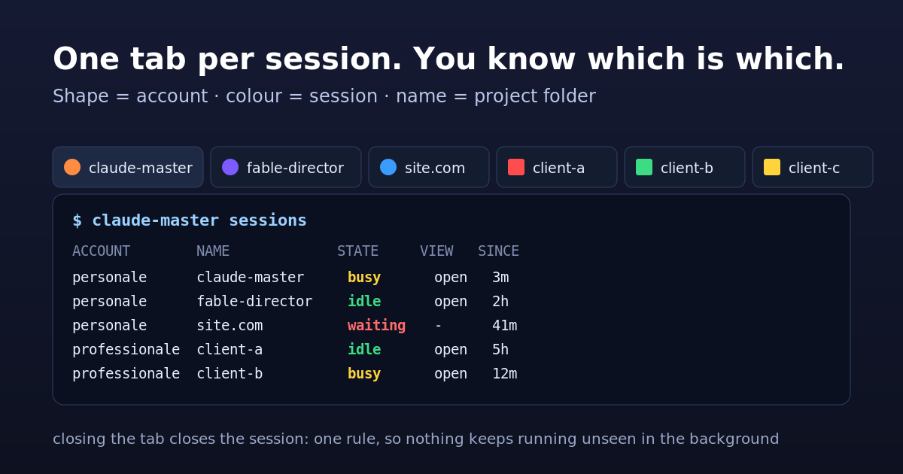
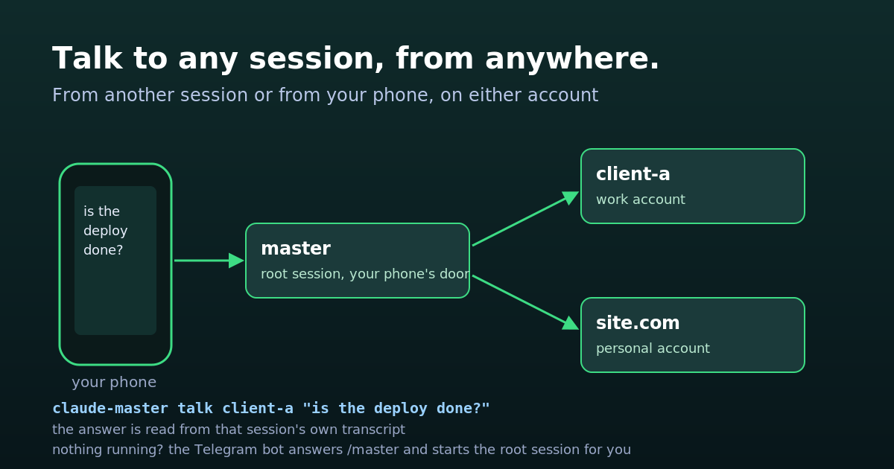
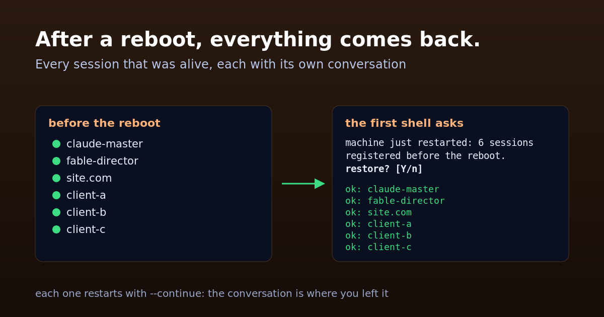
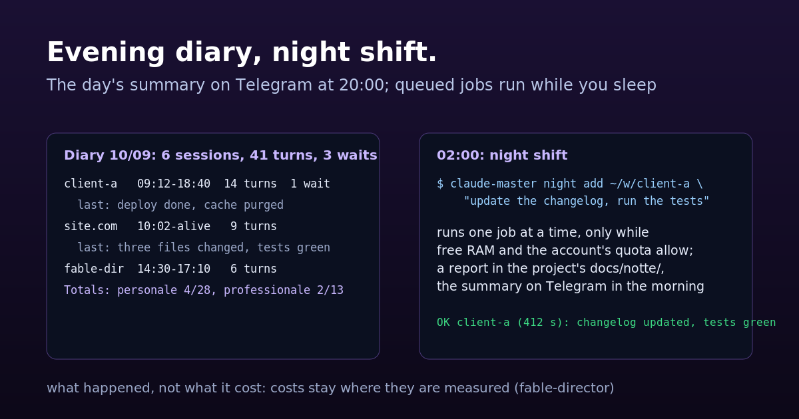

# claude-master

  

**Run several Claude Code sessions on one computer without losing track of
them.** Each project gets its own terminal tab with a name and a colour; one
list shows what is running; you can send a prompt from one session to another,
or from your phone; a restart keeps the conversation; and after a reboot, the
first shell you open offers to bring every session back. One session, the
**master** on your workspace root, runs all the others: it is the one your
phone talks to, and it launches, watches, answers and closes the rest.

**Who it is for, honestly:** people who keep three or more Claude Code sessions
open at once, on one machine, with one or two Claude accounts. If you open one
session at a time, you do not need it. It runs daily on one workstation
(ChromeOS, two accounts, up to eight sessions); the other terminals are
supported in code but not yet tried on real hardware — the table further down
says which.

## Before you start

- Claude Code 2.1.263 or newer, `tmux`, `python3` 3.8+ and `bash` on the PATH.
- A terminal from the list below. On ChromeOS the window commands also need
  [chrome-bridge](https://github.com/frsorrentino/chrome-bridge), a small
  extension-plus-server that lets scripts move Chrome windows.
- Optional, for the phone features: Claude Code's own `telegram` plugin,
  already configured with your bot and your chat.

## Quickstart

```bash
claude plugin marketplace add frsorrentino/claude-master
claude plugin install claude-master@fsorrentino --scope user
claude-master init --dry-run             # reads your machine and shows every value it found, with its source
claude-master init --yes --shim --shell  # writes the config; --shim = the `claude-master` command in ~/.local/bin;
                                         # --shell = the file that makes `claude` open a named tab
claude-master doctor                     # all green, or one line per thing to fix
claude-master launch ~/projects/x        # your first session, in its own tab
```

`init --shell` prints one line to add to your `.bashrc` or `.zshrc`. From then
on, typing `claude` in a project folder opens that project's session in a
named, coloured tab instead of an anonymous window. To undo everything:
`claude plugin uninstall claude-master`, remove that line, and
`claude-master bot uninstall` / `diary uninstall` / `night uninstall` if you had
turned those on.

## What you get



- **You know which window is which.** Every session lives in its own terminal
  tab: the icon's shape says which account, the colour which session, the name
  is the folder. Closing the tab closes the session, so nothing keeps running
  unseen. Sessions started without a tab (`--no-window`) are the deliberate
  exception: they live on until you close them by name.
- **The right account by default.** Personal folders open on your personal
  account, client folders on the work one, by a map you set once. Typing the
  other account on purpose gets a note, not a refusal.
- **One list for everything running.** `claude-master sessions` shows every
  session of every account: busy, idle, or stopped on a question waiting for
  you, and whether a tab is attached to it. `claude-master next` picks the one
  that needs you most.



- **Sessions talk to each other.** From any session, or from your phone through
  the *root session* (the one open on your workspace folder), you send a prompt
  to another session, on either account, and read its answer.
- **Restart without losing the conversation.** `restart arm` restarts the
  current session when its turn ends and resumes where it was; `--clean` starts
  fresh, `--switch-account` continues the same conversation on the other
  account.
- **A screenshot from the phone lands in the right project.** `report` files
  the image in the project's folder and hands it to that project's session,
  starting one if needed.



- **After a reboot, everything comes back.** The first shell you open notices
  the machine just restarted and offers to relaunch the sessions that were
  alive; say yes and they are back, each with its conversation.
- **Windows arranged from the keyboard** (ChromeOS): side by side, all as tabs
  of one window, or moved to another monitor, with one key or by name.



- **The phone works even when nothing is running.** A small Telegram bot answers
  `/master` and `/launch <project>` when every session is closed. Each evening
  it sends the day's recap: one sentence per project on what was done, the
  ones waiting on a question first, with a link to open each live one; the same
  line lands in the project's `docs/recap.md`, so every folder keeps its own
  history for free. And a queue of overnight jobs runs while you sleep, one at
  a time, only while free memory and your quota allow, leaving a report in the
  project.

**Why not plain tmux?** tmux keeps sessions alive; it does not know which
Claude account a folder belongs to, which session is waiting on a question,
how to ask another session something and read the answer, or how to bring
eight conversations back after a reboot. That is the part this plugin adds,
on top of tmux, not instead of it.

## What it does

Ten commands cover a normal day; the complete reference is at the end.

| you want to… | you type |
|---|---|
| open a session on a project | `claude-master launch <folder>` (or just `claude` inside it) |
| see everything running | `claude-master sessions` |
| find what needs you | `claude-master next` |
| talk to another session | `claude-master talk <name> "…"` |
| answer the question another session is stuck on | `claude-master answer <name> --show` · `answer <name> 2` |
| close one | `claude-master close <name>` (refuses one with a tab attached: close the tab instead) |
| restart this one, keep the conversation | `claude-master restart arm` |
| send a screenshot to a project | `claude-master report <project> <image> "…"` |
| get everything back after a reboot | `claude-master restore` (the shell offers it) |
| arrange the windows | `claude-master tile` · `merge` · `move destra` · `layout save mattina` |
| put a session to sleep, wake it later | `claude-master park <name>` · `unpark <name>` |

Inside a session the same things are slash commands (`/claude-master:sessions`,
`:launch`, `:close`, `:restart`, `:report`, `:quota`), and a short set of rules
is loaded at every start so the agent knows how to resolve a half-typed folder
name, that it may create a folder only if you asked, and how to reach another
session.

## What you are trusting

Three things are worth knowing before you turn them on.

- **Sessions start with `--dangerously-skip-permissions`** if `init` sees that
  your existing sessions use it (it says so, with the source). That is what
  lets a session work unattended, restart itself, or answer another session
  without a human pressing "allow". Without it a session cannot run commands
  at all. Remove it from `session.claude_args` if you want the permission
  prompts back.
- **`crossSessionInbound: accept`** in an account's settings lets another
  session on this machine send prompts to that account's sessions. It is
  needed only for `talk` across accounts, and it means: whoever can run
  commands on this machine can talk to those sessions.
- **The Telegram bot** answers only chats already in the `telegram` plugin's
  allow list, only three commands, and discards its backlog on the first run
  so an old message cannot start anything.

The plugin adds no background process of its own: each session is a Claude
Code process (a few hundred MB each), the bot, the diary and the night queue
are scheduled tasks that run for seconds.

## How it works

Every session is a `tmux` session named after its folder, started with Claude
Code's *Remote Control* (the feature that shows a session in the Claude app on
your phone and lets you drive it from there), so it appears there under the
same name. The plugin reads the session registry Claude Code already keeps
(`~/.claude/sessions/`, one per account) and talks to a session through the
inbox socket Claude Code already opens. Six small *hooks* (actions Claude Code
runs at events: a session starts or ends, a turn ends, a permission is asked)
keep the list fresh, stamp the local time on every prompt, deliver queued
prompts, and run the restart you armed. State lives in one folder, the
configuration in one JSON file, and every value in it was read from your
machine by `init`, with defaults only where nothing was found.

## Configuration

One file for the whole machine, `~/.config/claude-master/config.json`, written
by `claude-master init` from what it finds: your accounts and their folders,
the workspace root, the terminal you use, the language of the messages. You
rarely touch it; when you do, `claude-master doctor` tells you if something no
longer adds up. A minimal example for two accounts:

```json
{
  "workspace": {"root": "~/Desktop/workspaces"},
  "accounts": {
    "personal": {"config_dir": "~/.claude", "shell_command": "claude"},
    "work":     {"config_dir": "~/.claude-work", "tmux_prefix": "w-", "shell_command": "claude-work"}
  },
  "default_account": "personal",
  "folder_map": [{"path": "~/Desktop/workspaces/clients", "account": "work"}],
  "session": {"claude_args": ["--dangerously-skip-permissions"]},
  "terminal": {"backend": "chromeos"}
}
```

| key | what it decides |
|---|---|
| `accounts.<name>` | one entry per Claude account: its config folder, the tab's shape, a prefix for its session names, the shell command that opens it |
| `folder_map` · `workspace.root` | which folders belong to which account; the root opens the `master` session |
| `session.claude_args` · `session.link_wait_s` | flags every session starts with; how long `launch` waits for the Remote Control link (20 s) |
| `terminal.backend` | `chromeos`, `gnome`, `kitty`, `iterm2`, `macos-terminal`, `wt`, `none` |
| `shell.*` · `tmux.keybindings` · `tile.*` | the wrappers and aliases `init --shell` generates, the three keys of the `.tmux.conf` block, the window layout rules |
| `bot.*` · `recap.*` · `night.*` · `guard.*` | the Telegram bot, the evening diary, the night queue: all off or empty until you turn them on |
| `language` | `it` or `en` |

The full list with defaults: [`claude-master/config.example.json`](claude-master/config.example.json).

## From the phone when nothing is running

Claude Code's `telegram` plugin lets you talk to a live session from your
phone. When every session is closed there is nobody to talk to. `claude-master
bot` fills that gap: a scheduled task, once a minute, polls the same Telegram
bot (same token, same allowed chats) and answers four commands only —
`/master` starts the root session and replies with its link, `/launch <name>`
starts a project (one match starts it; several or none are listed, never
created), `/sessions` lists what is running, `/recap` sends today's diary. It stays quiet while a session's
plugin is listening.

Turning it on, and the two companions:

```bash
# config.json: "bot": {"enabled": true}
claude-master bot install      # the once-a-minute task; `bot status` says who is listening
claude-master recap install    # the day's diary to the same chats at 20:00 (diary.cron_time)
claude-master night install    # the overnight queue at 02:00 (night.cron_time); fill it with `night add`
```

Two limits, stated plainly. After a **reboot** nobody is logged in and
scheduled tasks do not run: the bot covers «sessions closed, machine awake»,
not «machine off» — on a Chromebook, set the power options so the machine does
not sleep while charging. And the diary reports *what happened*, not what it
cost: costs stay where they are measured (for me, fable-director).

## Terminal backends

| backend | tried on real hardware | notes |
|---|---|---|
| `chromeos` | **yes**, daily | ChromeOS Terminal; tabs, colours, `tile`/`merge`/`move`/`layout` |
| `none` | yes | no tab: sessions live in tmux, `tmux attach -t =<name>` |
| `gnome` | no | `gnome-terminal --tab`; written from the docs, covered only by tests with a fake terminal |
| `kitty` | no | same |
| `iterm2` · `macos-terminal` | no | same, through AppleScript |
| `wt` | no | Windows Terminal, from a Linux shell under WSL; same |

On an untried backend the first launch is the test: `launch` says whether the
tab attached and, if it did not, prints the `tmux attach` line so nothing is
lost. If it fails, `terminal.backend: none` keeps everything else working.
Arranging windows exists only on ChromeOS through chrome-bridge, and Chrome
only sees a monitor that has a window on it: `move` tells you to drag one there.

## Requirements

- tmux (tested with 3.3a), python3 ≥ 3.8, bash; Claude Code ≥ 2.1.263.
- `crossSessionInbound: accept` in an account's settings, only to receive
  `talk` from the other account.
- chrome-bridge ≥ 1.16.1, only for the window commands on ChromeOS.
- Claude Code's `telegram` plugin, only for the bot, the diary and the night
  summary.

## Commands

The complete reference. Italian aliases (`lancia`, `chiudi`, `sessioni`,
`affianca`…) come from `init --shell`; every flag accepts both spellings
(`--crea`/`--create`, `--prova`/`--dry-run`).

| command | what it does |
|---|---|
| `claude-master init [--dry-run\|--yes] [--force] [--shim] [--shell] [--cron] [--tmux]` | reads the machine and proposes or writes the configuration; the flags print (or install with `--yes`) the shim, the shell file, the crontab line, the `.tmux.conf` block |
| `claude-master doctor` | PASS / WARN / FAIL with a remedy per line |
| `claude-master config [--sh\|--get KEY\|--path]` | the effective configuration |
| `claude-master launch <dir> [--create] [--continue\|--resume <id>] [--account N] [--no-window] [--bg] [--profile N]` | a session in tmux; dialogs answered, startup confirmed by the registry, tab verified attached |
| `claude-master sessions [--watch]` | every live session of every account |
| `claude-master close <name> \| --abandoned [--dry-run]` | closes a session nobody is attached to; refuses one with a tab |
| `claude-master restart arm [--clean\|--switch-account [N]]` | restart when the turn ends |
| `claude-master talk <name> "prompt" [--wait S] [--force]` | a prompt to another session, the reply read from its transcript |
| `claude-master answer <name> --show` · `answer <name> <n> [--text "…"]` | reads the question another session is stuck on (options numbered) and answers it by number, from any session or from the phone through the root session |
| `claude-master wait <name> [--timeout S]` | blocks until that session is idle |
| `claude-master report <project> <image\|-> "text" [--no-launch]` | screenshot into the project's `docs/segnalazioni/`, prompt delivered |
| `claude-master queue <name> "prompt" [--expires M] \| --show \| --clear` | a prompt delivered when that session's next turn ends |
| `claude-master next [--all] [--attach]` | the session that needs you most |
| `claude-master park <name> \| --idle-over D \| --ram-below MB [--auto]` · `claude-master unpark <name>` | hibernate a session and bring it back |
| `claude-master registry [--show]` | refresh the list of sessions to restore (also from cron) |
| `claude-master restore [--dry-run\|--yes]` | relaunch the sessions registered before a reboot |
| `claude-master cloud <dir> "task"` · `claude-master follow <id> "message"` | a cloud session from the folder's account; a message to it |
| `claude-master desk [start\|stop\|status]` | a Remote Control desk in the workspace root (optional, off by default) |
| `claude-master tile [names] [--rows\|--grid] [--on PLACE] [--dry-run] [--where]` · `claude-master merge` · `claude-master move PLACE` · `claude-master layout save\|restore\|list NAME` | windows side by side, as tabs, on another monitor, or by saved layout (ChromeOS) |
| `claude-master attach <name>` · `claude-master color <name>` · `claude-master quota` | attach a terminal; the tab's shape and colour; how full each account's quota is |
| `claude-master guard run` · `install\|uninstall\|status` | quota guard: one Telegram warning per window above `guard.warn_pct` with the reset time; at the reset, the sessions that hit the wall get «resume where you were» and a pending night queue runs | |
| `claude-master bot poll\|install\|uninstall\|status` | the Telegram bot for when nothing is running (`/master`, `/launch`, `/sessions`, `/recap`) |
| `claude-master recap [--date D\|--since H] [--send] [--full]` · `recap install\|uninstall\|status` | the day's diary, per project: waiting on a question first (with a link), then alive, then closed |
| `claude-master night add <dir> "prompt" [--model M] [--effort E] [--max-turns N]` · `list` · `remove <id>` · `run [--dry-run\|--one] [--send]` · `install\|uninstall\|status` | the overnight queue |

## Tests

```bash
for t in tests/*-verify.py; do python3 "$t"; done
```

Twenty suites, about 350 cases, none of which touch your real tmux, your real
Claude or your browser: a private tmux server, a fake `claude` that draws the
real dialogs and writes the real registry files, a fake browser that follows
Chrome's rules, a fake Telegram. Every defect found on the real machine became
a test before it was fixed. The README cards are generated by
`tools-readme-cards.py`, no model involved.

## License

MIT — Francesco Sorrentino.
