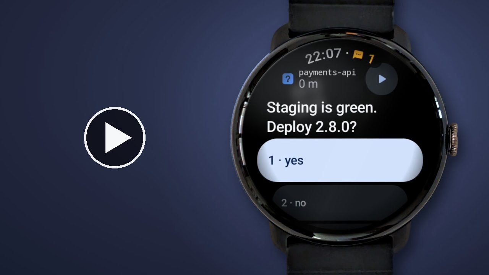
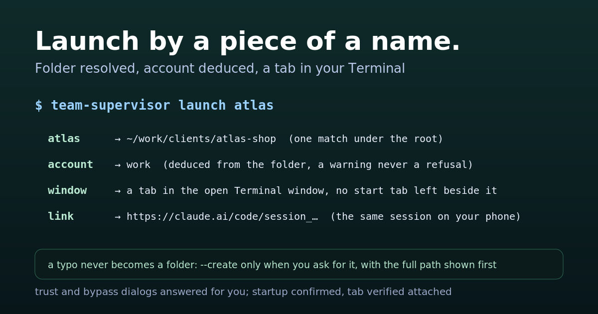
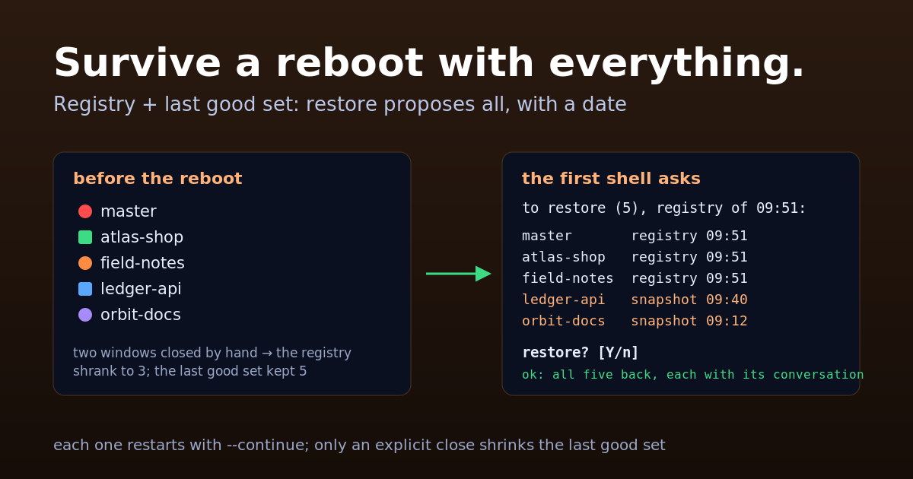
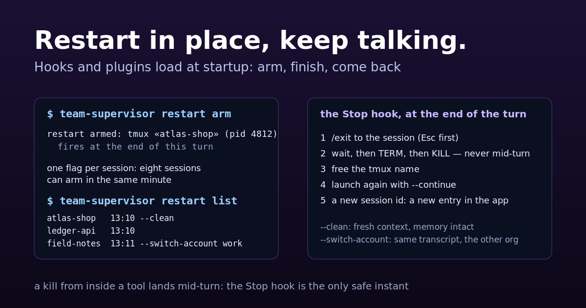
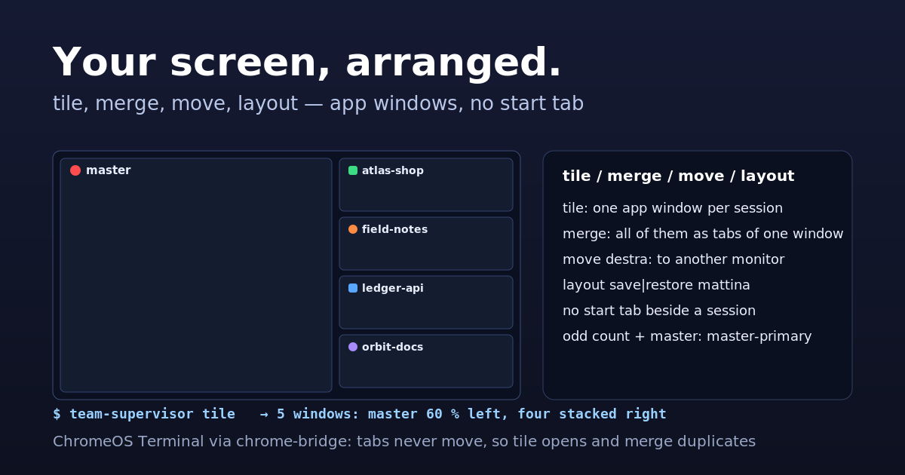
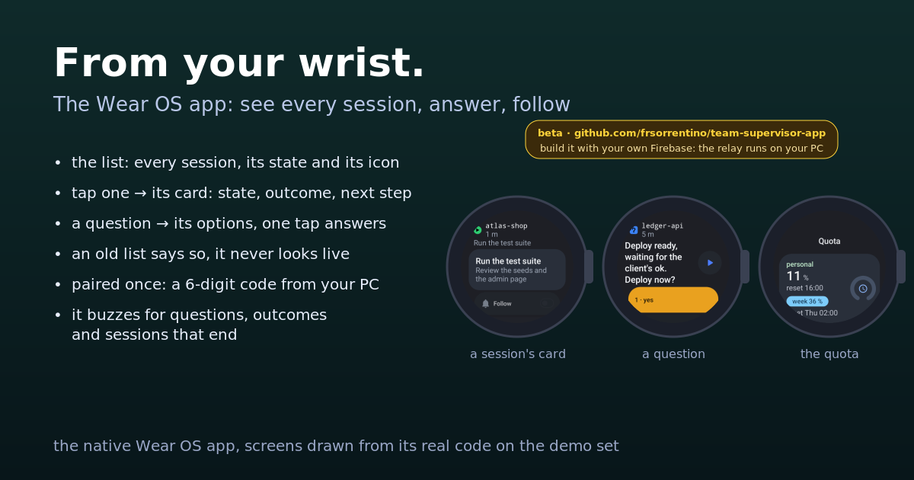
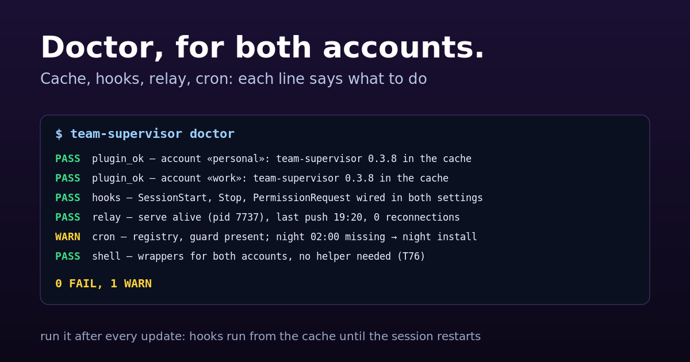

# team-supervisor

  

[](https://www.francescosorrentino.com/plugins/claude-master-watch)

**Run several Claude Code sessions on one computer without losing track of
them.** Each project gets its own terminal tab; one list shows what is running
and which session is waiting for you; you can answer it from another session,
from your phone or from your watch; after a reboot every session comes back
with its conversation. One session, the **master** on your workspace root,
launches, watches, answers and closes the others.

It is for people who keep three or more sessions open at once. If you open one
at a time, you do not need it.

## Try it

**The plugin.** Claude Code 2.1.263 or newer, `tmux`, `python3` 3.8+, `bash`
and a [supported terminal](#terminal-backends), on Linux, macOS, ChromeOS or
WSL2 ([not native Windows](#windows)).

```bash
claude plugin marketplace add frsorrentino/team-supervisor && claude plugin install team-supervisor@team-supervisor-dev --scope user
```

Then `team-supervisor init --yes --shim --shell` and `team-supervisor doctor`:
the [Quickstart](#quickstart) has each step.

**Phone and watch: beta, testers welcome.** Sign up at [groups.google.com/g/claude-master-testers](https://groups.google.com/g/claude-master-testers) to get the
phone and watch apps from Google Play. You need an Android 13+ phone, a Wear OS
4+ watch, and on the PC `python3-cryptography`, `crontab` and the Firebase CLI
logged in (`npm install -g firebase-tools`, `firebase login`). Then, on the PC:

```bash
team-supervisor relay setup     # your own Firebase project, guided; --dry-run shows the steps
team-supervisor relay pair      # a QR: scan it with the phone app
team-supervisor relay install   # keeps the relay running
```

The phone pairs with the PC and passes the key to the watch, which then works
on its own. Everything is encrypted end to end; Firebase sees only blobs.
Details: [Relay for the Wear OS app](#relay-for-the-wear-os-app).

**No PC at hand?** On the watch's pairing screen, tap «Try the demo»: sessions,
questions and quota of a demo set, with no PC and no pairing. Settings → «Demo
mode» turns it off.

## Quickstart

It runs daily on one workstation (ChromeOS, two accounts, up to eight
sessions); the other terminals are supported in code but not yet tried on real
hardware: [Terminal backends](#terminal-backends) says which. On ChromeOS the
window commands also need [chrome-bridge](https://github.com/frsorrentino/chrome-bridge).

```bash
claude plugin marketplace add frsorrentino/team-supervisor
claude plugin install team-supervisor@team-supervisor-dev --scope user
team-supervisor init --dry-run             # reads your machine and shows every value it found, with its source
team-supervisor init --yes --shim --shell  # writes the config; --shim = the `team-supervisor` command in ~/.local/bin;
                                         # --shell = the file that makes `claude` open a named tab
team-supervisor doctor                     # all green, or one line per thing to fix
team-supervisor launch ~/projects/x        # your first session, in its own tab
```

`init --shell` prints one line to add to your `.bashrc` or `.zshrc`. From then
on, typing `claude` in a project folder opens that project's session in a
named, coloured tab instead of an anonymous window. To undo everything:
`claude plugin uninstall team-supervisor`, remove that line, and
`team-supervisor recap uninstall` / `night uninstall` / `guard uninstall` if you
had turned those on.

## What you get


Every function has a card; every card has a function behind it. The sessions
in the pictures (`master`, `atlas-shop`, `ledger-api`, `field-notes`, `orbit-docs`) are a demo set.

### Sessions at a glance


`team-supervisor sessions` lists every session of every account: busy, idle, or
stopped on a question waiting for you, whether a tab is attached, which
channel reaches it. A detached session stuck on a question is work standing
still, not work in progress: it goes first. `team-supervisor next` picks the one
that needs you most. Three more notes on a row, read without asking anyone:
«at lower priority» when the session runs past its limit in `/low-priority`
mode (slow but alive; it shows only on the session's own screen, so the note
needs its tmux pane), «goal: …» when a native `/goal` is still open (from the
transcript), and «idle for N h» with the close command when a session has done
nothing for `sessions.idle_hours` hours. `quota` counts the lower-priority
sessions per account under its table; `wait` says when it returns on an open
goal (idle with a goal not met is «Goal paused», not finished work).

The `work-` in front of two names is the tmux prefix of the `work` account in the
demo set: every account has its own, set in `accounts.<name>.tmux_prefix`.

### Launch by a piece of a name



`team-supervisor launch atlas` resolves the folder under your workspace root,
deduces the account (personal or work, by a map you set once: a warning, never
a refusal), stops on the trust and bypass dialogs for you to accept them (or
answers them, if you list them in `session.dialog_patterns`), and opens the session as a
tab of the Terminal window you already have, with no start tab beside it. A
typo never becomes a folder: `--create` only when you ask, with the full path
shown first. Typing `claude` inside a project folder does the same. Past
`sessions.max_sessions` sessions at work (5 by default; busy or idle, the
master excluded) `launch` stops with the count and the free memory and asks;
without a terminal it exits 7 and says to close an idle session or repeat with
`--force`. It never closes anything on its own.

### Talk. Answer its question.


`team-supervisor talk ledger-api "deploy done?"` delivers a prompt to another
session, on either account, and reads the answer back from its transcript.
`team-supervisor answer ledger-api --show` reads the question a session is stuck on,
options numbered; `answer ledger-api 1` answers it: a message in the inbox never
unblocks a dialog, this does. The phone gets the same question with its
options as buttons the moment the session stops.

### Survive a reboot with everything



The first shell after a reboot offers to bring every session back, each with
its own conversation. Two lists feed it: the registry, reconciled every five
minutes, and the «last good set», which grows with the sessions and never
shrinks on its own — two windows closed by hand before the reboot cannot make
a session disappear from the proposal. `team-supervisor restore --dry-run` shows
what would come back, with the source and the date of each.

### Restart in place, keep talking



`team-supervisor restart arm` restarts the current session when its turn ends
and resumes where it was, because hooks, settings and plugins are read at
startup only. It keeps the model too: a new default model reaches a resumed
session only through `/model`, while `launch` starts on it. One flag per session, so eight sessions can arm in the same
minute; `restart list` shows them. `--clean` starts fresh with the memory
intact, `--switch-account` continues the same conversation on the other
account. A kill from inside a tool would land mid-turn: the hook is the only
safe instant.

### Your screen, arranged



On ChromeOS, `team-supervisor tile` gives every session an app window of its
own and arranges them: equal columns, a grid when they get narrow, and with an
odd count that includes the master, the master big on the left and the others
stacked on the right. `merge` brings them back as tabs of one window, `move
destra` sends them to another monitor, `layout save mattina` remembers a
layout. The Terminal's start tab is evicted, never left beside a session.

### From your wrist



The native Wear OS app is out in **beta**:
[github.com/frsorrentino/team-supervisor-app](https://github.com/frsorrentino/team-supervisor-app).
Sign up as a tester ([Try it](#try-it)), or build it yourself from the app's
README. The relay runs on your PC, with your own Firebase. The list shows every
session with its state and icon; a tap opens its card — state, outcome, next
step; a question comes with its options, and one tap answers it. A list that is
no longer fresh says so and never looks live, the watch is paired once with a
6-digit code from your PC, and it buzzes for questions, outcomes and sessions
that end.

The plugin works without the app: everything above happens in the terminal
either way. watchOS is not supported. Telegram only sends notices (below).

### Telegram, one-way

Telegram sends; nobody answers it. The interactive bot — bare-word commands,
inline keyboards, session cards, «follow», the long-polling daemon and the 08:00
digest — was retired on 16/09/2026: the watch does all of it in real time, and
Telegram had become a second copy of every notice. What goes out now is what a
watch cannot carry or will not receive:

- the day's diary at 20:00 and the night shift's report, which are long texts;
- the quota warnings, when no watch is receiving them;
- a question a session is stuck on, when the watch is not paired, or the relay
  or the network is down — the phone is then the only channel left.

`team-supervisor bot status` shows the token, the allowed chats and the log; there
is no daemon to keep alive any more. The morning «what waits for you» lives on
the watch, which shows without pause who is waiting on a question and who is
idle.

### Relay for the Wear OS app

`team-supervisor relay` puts the PC on the bus of the native watch app
([github.com/frsorrentino/team-supervisor-app](https://github.com/frsorrentino/team-supervisor-app),
whose README has the watch side under «Set up»):
`relay push` publishes an encrypted `/state` (the v1 contract in
`tests/fixtures/relay/`) to Firebase RTDB, appends `/events` and wakes the watch
with FCM; `relay serve` listens on `/cmd` and runs the allow-listed commands
(answer, prompt, launch — with an optional first message — follow, resume, reopen, screen, allow_all, last, model, effort) through the CLI,
writing `/result`; `relay pair` shows a QR for the phone app and a six-digit
code for the watch, and agrees the AES key over X25519 with whichever answers
first. Setup: a Firebase project with RTDB and FCM, its
service account JSON in `~/.team-supervisor/relay/service-account.json` (0600,
never in the repo), `relay.enabled`, `relay.firebase_url` and `relay.fcm_topic`
in the config, then `relay pair`, `relay install`. RTDB rules: `/state`,
`/events` and `/result` readable only by a uid present in `/allowed`, `/cmd`
and `/share/<id>` writable only by those, `/pair/<code>/watch` and `/pair/<id>/watch` writable by
an anonymous user; the PC writes with the service account. `relay push
--dry-run` prints the clear state without touching the network.

Contract 1.16 adds two fields to every session in `/state`: `low_priority`
(`off`, `offered` when Claude Code proposes `/low-priority` at the usage limit,
`active` when the session runs on past it, `null` when there is no screen to
read it from — that state lives only in the session's memory) and `goal`
(`{text, since, met}` from the last `goal_status` of the transcript, `null`
without a `/goal`).

Contract 1.17 lets the app edit tonight's queue: `night_add` (the folder of a
published project and the prompt, run as `team-supervisor night add`) and
`night_remove` (the job id), and `/state` carries `night.items`, the queue in
run order with each prompt cut to 160 characters. The field is there even when
the queue is empty: its absence tells the app to ask for an update. The queue
holds at most `night.max_queued` jobs (8), and a job that has started cannot be
removed.

Contract 1.18 sends the long texts to the app too, as events with the FCM
wake-up: `recap` (the 20:00 diary) and `night_report` (the night shift's
summary), with the Telegram text without markup, cut at a line end within 4000
characters, and the day in `ref`; the quota guard's resume at the reset is a
`quota` event like the threshold warning.

Contract 1.19 is «Share» from the phone: the phone writes an image, encrypted
like a command, in `/share/<id>` (at most 1.5 MB, JPEG or PNG), then sends
`report` with the session, the text and that id; the relay runs
`team-supervisor report <session folder> <image|-> "<text>" --session <name>` and
deletes the node, whatever the outcome (unread nodes go after 10 minutes).
`/state` carries `share: {max_bytes}` so the app knows it can.

Contract 1.21 adds the Stop button: `interrupt` with the session runs
`team-supervisor interrupt`, and `/state` carries `ops`, the command ops this relay
executes, so the app shows a button only when its op is there.

Contract 1.22 is the conversation for the phone's chat: `transcript` with `n`,
`n:before=<id>` or `n:after=<id>` answers with the session's entries read from
its transcript — what the person typed, Claude's text, one line per tool call
(with its description, whether it failed, and the media or documents it wrote or
sent), and the tokens and times of each closed turn — at most 60 KB a page.

Contract 1.23 adds `suggestion` to every session in `/state`: the prompt Claude
Code suggests in dim text after `❯` when the input is empty, read with its
colours from the pane, for a session at the prompt only — never typed text.

Contract 1.24 opens a file from the conversation on the phone: `file` with the
session and, as `arg`, a `path` exactly as `transcript` lists it in `files`.
The relay serves only a path listed in that session's transcript and writes it
to `/file/<command id>`, encrypted like `/share`, as `{mime, data}`. An image
over the 1.5 MB envelope is reduced to a JPEG; any other file over it is
refused. The device deletes the node after reading it; unread nodes go after
10 minutes. Refusals: «no session …», «not in the transcript», «missing or
unreadable», «too large: <bytes>».

Contract 1.25 sends slash commands from the phone: `slash` with the session, the
command without «/» as `arg` and its arguments as `text`. Only the commands in
`relay.slash_commands` (default compact, clear, exit, context, cost), listed in
`/state` as `slash`, are accepted. The relay types the command in the session's
pane like the person at the terminal; through the inbox socket it would arrive as
another session's message and not run. A busy session, or one on a dialog, is
refused («<name> is busy»), as is a command outside the list («not allowed: …»).
A command that opens a panel over the prompt (`/cost`, `/usage`) has its text
read and sent back in the result, then the panel is closed with one Esc
(`team-supervisor panel <name>`), so nothing stays open on the PC.

Contract 1.26 gives the phone the whole project list for «Launch»: `projects`
answers with every project of every account (the fields of `/state.projects`),
most recently used first, at most 60 KB. When `/state` must drop projects to
fit in 8 KB, it keeps the most recently used ones instead of the first by name.

Contract 1.27 lets the phone search every conversation: `search` with the text
(1 to 200 characters) looks through the user and assistant messages of the live
sessions and of those closed in the last 7 days, on both accounts, ignoring case
and accents. It answers at most 50 hits, newest first, each with the session,
the folder, the entry id of `transcript` to jump to, and a snippet of up to 160
characters with the word's position; past 50 hits, 60 KB or 10 s, `more` is true.

Contract 1.28 lets the phone send files of any format, not only images: a PDF,
a text, an archive lands in `.claude-master-inbox/` inside the session's folder
(ignored by git) and the session is told its name, type, size and path.

Contract 1.30 adds a device without unpairing the others: `relay pair --add`
keeps the relay's key and hands it to the new device encrypted inside the
pairing confirmation; the devices already paired stay (eight at most, contract 1.39: a browser with the web app counts as one). A plain
`relay pair` still replaces the key and every device.
From the phone the same happens without the PC's terminal (contract 1.31, op
`pair_add`): the relay opens the round by itself and the phone shows its QR to
the new device.
On a Chromebook the invite opens by itself in the app on the same machine
(contract 1.32, through adb to its Android), and `/state.devices` lists every
paired device with its kind and when it last read.
Contract 1.34 sends a file of the chat in parts of 1 MB, up to 25 MB, so a
long HTML report or a PDF opens on the phone as it is.
Contract 1.35 serves the web app on the same machine: with `relay.web.enabled`
the relay daemon listens on `127.0.0.1:<relay.web.port>` (8765 by default),
serves the built web app from `relay.web.dir` on `/` and a local API with the
contract's JSON in clear (state, events, a state stream, commands, files,
attachments) behind a local token. `team-supervisor relay web` prints the address
with the token and opens it in the browser.
Contract 1.36 labels what comes from the web app («via the web app»), and
contract 1.37 brings the master's help to the app: fable-director's advice of
model and effort for each session, the registry's tasks waiting for an ok with
an «Approve» button (op `approve`), «Save as decision» for the master's memory
(op `decision`), and the sessions that are finished or duplicated.
Contract 1.42 serves the app's live mode: a prompt dictated by voice
(`voice: true`) carries short spoken-answer instructions after the device's
prefix, and an approval given from the wrist (`via: "live"`) counts only with a
double confirmation (`confirmations` of 2 or more).

Contract 1.20 counts the phone as well as the watch before falling back to
Telegram. Each paired device writes `/seen/<uid>` (the Firebase server time)
when it reads `/state`; if no paired device has read an event within
`relay.telegram_fallback_after_s`, the event goes to Telegram once. Until some
device writes `/seen`, only the old rule applies (the bus refusing the push).

The QR (contract 1.15) carries the pairing id, the PC's public key, the host,
the expiry and the data the phone needs to join the Firebase project: the
app's API key, project id and Android app id, from `relay.firebase_app`, or read
from the `google-services.json` named in `relay.google_services` (its Android
client; `relay.app_package` picks one when the file has more than one); the
database URL and the FCM topic
come from the relay's own config. Without those data `relay pair` says so, shows
no QR and the six-digit code still works; `doctor` shows a WARN. The QR is
drawn in the terminal with half blocks, error correction L and a two-module
margin (about 70 columns wide; `relay pair --text` prints its JSON on one line
instead). The same
document sits under `/pair/<code>` and `/pair/<id>`; the first valid answer
wins, the other node is deleted, expiry and attempts are shared. The phone may
answer with `uids` (up to four) and `names`: every uid goes to `/allowed`, and
`devices.json` keeps each with its name.

`relay setup` builds the Firebase side, guided and idempotent, on the Firebase
CLI already logged in (`npm install -g firebase-tools`, `firebase login`): it
picks or creates the project, creates the Realtime Database instance
(`relay.setup_location`, europe-west1 by default), deploys the rules above,
enables anonymous sign-in, registers the Android app of `relay.app_package`
without a SHA fingerprint (the API key is not restricted: the Play signature
differs from the development one), saves its data in `relay.firebase_app` and
`<relay.dir>/google-services.json`, creates the firebase-adminsdk key at
`relay.service_account` (0600) and writes `relay.enabled`, `relay.firebase_url`
and `relay.fcm_topic` into the config in use, `TEAM_SUPERVISOR_CONFIG` included.
The database instance, anonymous sign-in and the key go through Google's REST
APIs with the CLI's own token; when that token is missing, those steps print
the exact console link and wait for Enter. On a project born a minute ago
Authentication has to be opened once in the console («Get started»), because
no API initializes it without billing: `relay setup` says so, waits, then
enables the provider. A key file that belongs to another project is never
replaced. `--dry-run` lists what would be done and writes nothing; `--yes` takes
the defaults; the end is a summary like `doctor`'s.

To try the app without touching the watch already paired, point
`TEAM_SUPERVISOR_CONFIG` at a trial config with its own `relay.dir`,
`relay.service_account` and `relay.firebase_url`: `relay pair`, `relay push` and
`relay serve` then work only there, and the main config's key, `devices.json`,
`/allowed` and crontab stay as they are.

Each session in `/state` carries the badge the watch draws: `icon`, the emoji
of its Terminal tab (stable for the session's life, the last known one once it
is gone), and `color`, the hue alone as `#RRGGBB` whatever the shape — the
watch takes the shape from the account (round for the personal one, square for
the others) and the colour from here, so a session looks the same on the PC, in
Telegram and on the wrist. `relay.colors` overrides the emoji-to-hex map.

Each session also carries what it is running on: its model (id and short name),
its effort level and how much of the context window it has used, read from its
transcript. They are null when they cannot be read, and the percentage is left
out rather than guessed when the model changed mid-session.

When a push cannot reach the bus, or the wake-up fails, the relay notes when the
outage started and, once it lasts longer than `relay.telegram_fallback_after_s`
(ten minutes by default), the notices go out on Telegram instead, until a push
works again.

### Guard, diary, night


`team-supervisor guard` warns once per window when an account passes 95 % of
its quota and, at the reset, sends «resume where you were» to the sessions
that hit the wall. At 20:00 the recap: one sentence per project on what was
done and the next step, the ones waiting on a question first, the same line
appended to the project's `docs/recap.md`. At 02:00 the night queue runs one
job at a time, only while free memory and quota allow, leaving a report in the
project. What waits for you in the morning is on the watch, which never stops
showing it.

### Tasks and plans

A plan is a JSON file of units of work. Each unit names its folder, a check
that can fail (a command that exits 0 when the work is right), the files it may
touch, and a lane: open (local commits, tests, docs), wide (shared code) or
closed (push, release, publication). Edges exist only where one unit's output
really enters the next, and each edge says what passes. `team-supervisor plan
approve` records the approval once; `team-supervisor plan run` does the rest:
ready units run in parallel, each in a session of its folder (opened and closed
for it), a script unit without a session; the session's own outcome is
recorded, but only the check rerun by the engine marks a unit done. A red unit
goes back alone, with the reason and the narrowed perimeter, three times at
most; then it is failed, the units after it are cancelled and the root session
is told. The registry (`team-supervisor task`, SQLite next to the configuration)
keeps every task, result and approval, and the constraints that failed tasks
leave behind are attached to the next tasks of the same project.

The closed-lane guard (`tasks.guard`, off by default) is a PreToolUse hook on
Bash: `git push`, `gh release`, `npm publish` and `release.sh` pass only inside
a running task of an approved plan, or after a recorded ok.

fable-director is optional. When it is installed and enabled in the session's
account, the unit's brief asks it to open its budget with the unit's check as
`--verify` and its files as `--paths`; the task contract
(`schemas/task-contract.v1.json`) is the same file in both plugins. Without it,
nothing changes: the engine reruns the check itself.

`team-supervisor timeline` shows what the sessions did, in time order: the
prompts, the tests they ran with their summary line, the folder's commits, the
«Esito:» lines and the registry's outcomes, from code. The phone reads the same
timeline (contract 1.29, op `timeline`) for its summary; there each session's
`project` is relative to the projects' root, as in `state.sessions[].project`.

### More machines

One control machine, other computers doing the heavy work. You declare a host
by name and ssh alias; team-supervisor measures it and proposes what it can do:

```bash
team-supervisor host add laptop --ssh laptop     # pins the host key, asks before installing a 3-file helper
team-supervisor host doctor laptop               # OS, cores, RAM, GPU, WebGL, tools, a 20 s benchmark, bandwidth
team-supervisor host confirm laptop              # roles, limits and trust, as proposed or edited
team-supervisor offload ~/film --recipe render   # the exact commit, the declared assets, the result back
```

- **Measured, not guessed.** `doctor` runs one remote command that returns
  JSON: system, GPU (`nvidia-smi`, `lspci`, `Win32_VideoController`), WebGL
  from a headless Chrome (hardware or software renderer), tool versions, which
  Claude accounts are logged in, foreign credentials (named, never read), and a
  micro-benchmark relative to the control machine. It proposes roles
  (`compute`, `render`, `sessions`), per-host limits from a written formula,
  and trust `work` without secrets and without client folders. Until you
  confirm, the host gets nothing.
- **Jobs declare needs, not hosts.** A recipe in `<project>/.cm-offload.json`
  says role, threads, RAM, GPU, tools, operating systems and a command per host
  kind (`{threads}` takes the host's value). The scheduler filters hosts by
  trust and requirements, drops those without a free slot or above the load
  gate, and chooses: a light job stays here while this machine has room; a
  heavy one goes out when the measured time saved beats the copy cost (bytes to
  send ÷ measured bandwidth, plus setup). `--explain` prints the whole table;
  `--host` forces the choice but never trust or hard requirements.
- **What travels.** `git archive` of the exact commit (a dirty tree is refused,
  or sent as `git stash create` with `--dirty`); `.env*`, keys and credentials
  never leave, and a scan for private keys and known tokens blocks the send
  naming the file. Ignored assets travel once: the host keeps a content-addressed
  cache. Dependencies install once per lockfile hash. Results come back with
  their sha256 checked, into an ignored output folder or the state directory,
  never over a tracked file.
- **Surviving the link.** Jobs are detached so a dropped ssh does not kill
  them: `systemd-run --user` or `setsid` on Linux, a one-shot scheduled task on
  Windows. `offload wait <id>` blocks until the end, from a background shell.
  Since Claude Code 2.1.288 a background command's time limit (its `timeout`,
  two hours at most) applies only to unattended sessions (`-p`, Agent SDK, CI,
  cloud); for those, `wait` gives up by itself after 110 minutes (`--max-min`)
  with exit 4 and says the job is still running: run it again until it exits 0
  or 1. A terminal session has no limit.
- **Seeing it.** `hosts poll` (cron, every minute; every 30 s while something
  runs) writes one snapshot per host. `sessions` shows the other hosts'
  sessions as `HOST:name` and one line per host with load, RAM, disk and the
  heavy job's progress; `quota` merges the readings of every host and says
  where the freshest came from. An unreachable host is a line with the age of
  its last good read, never a hang.
- **A whole session elsewhere.** `launch <dir> --host win` starts a Claude
  session on a `windows-native` host with the `sessions` role, with Remote
  Control on, so it shows in the app as `win-<name>`. A rule in the config
  decides which folders may go, and every refusal names the condition it
  failed: the folder's account is in the host's `trust.accounts`; the folder is
  not in the client perimeter and is under the workspace root; it matches
  `hosts.H.sessions.allow` and no `deny` entry; no secrets (not in a recipe,
  not in the file names, not in the content). What goes there is a snapshot of
  HEAD (`git archive`, no secret files), never the history; the host has no git
  credentials. `host fetch win <name>` brings the commits made there back as
  patches on a local branch `win/<name>`, applied in a temporary worktree so the
  shared checkout is untouched; merge and push happen here. When this machine is
  loaded (1-minute load above its cores, or less than 2 GB free) `launch`
  suggests the host in one line; `--host auto` picks it.
  `talk win:<name> "…"`, `wait win:<name>` and `close win:<name>` reach it
  through its native inbox (the named pipe, the text in base64) and read the
  reply from its transcript there; `close` refuses a session mid-turn without
  `--force` and leaves the folder for `host fetch`.

Host kinds: `linux-tmux` (this machine or over ssh), `windows-native` (OpenSSH,
PowerShell 5.1+), `macos-tmux` and `wsl` over ssh. ssh options always go on the
command line with a dedicated `known_hosts`; `~/.ssh/config` is never touched.
Remote sessions start, talk and come back as above.

### Doctor, for both accounts



`team-supervisor doctor` checks both accounts: the plugin in the cache at the
right version, the hooks wired in, the relay's daemon alive, the cron lines
present; each line says what to do. Run it after every update: hooks run
from the cache, and a live session keeps its old version until it restarts.

**Why not plain tmux?** tmux keeps sessions alive; it does not know which
Claude account a folder belongs to, which session is waiting on a question,
how to ask another session something and read the answer, or how to bring
eight conversations back after a reboot. That is the part this plugin adds,
on top of tmux, not instead of it.

## What it does

Ten commands cover a normal day; the complete reference is at the end.

| you want to… | you type |
|---|---|
| open a session on a project | `team-supervisor launch <folder>` (or just `claude` inside it) |
| see everything running | `team-supervisor sessions` |
| find what needs you | `team-supervisor next` |
| talk to another session | `team-supervisor talk <name> "…"` |
| answer the question another session is stuck on | `team-supervisor answer <name> --show` · `answer <name> 2` (the watch shows you the options when it stops) |
| see what a session is doing, from the phone | `team-supervisor screen <name>` |
| close one | `team-supervisor close <name>` (one open in a tab is closed through its tab when idle; busy or asking: refused) |
| restart this one, keep the conversation | `team-supervisor restart arm` · `restart list` |
| send a screenshot to a project | `team-supervisor report <project> <image> "…"` |
| get everything back after a reboot | `team-supervisor restore` (the shell offers it) |
| arrange the windows | `team-supervisor tile` · `merge` · `move destra` · `layout save mattina` |
| put a session to sleep, wake it later | `team-supervisor park <name>` · `unpark <name>` |

Inside a session the same things are slash commands (`/team-supervisor:sessions`,
`:launch`, `:close`, `:restart`, `:report`, `:quota`), and a short set of rules
is loaded at every start so the agent knows how to resolve a half-typed folder
name, that it may create a folder only if you asked, and how to reach another
session.

## What you are trusting

Four things are worth knowing before you turn them on.

- **Sessions start with `--dangerously-skip-permissions`** if `init` sees that
  your existing sessions use it (it says so, with the source). Without it,
  every session asks you to confirm each command, as Claude Code does by
  default: nothing breaks, but a session stops at each command until someone
  presses "allow". What suffers is what runs with nobody at the keyboard:
  prompts and answers sent from the phone or from another session, a restart
  at the end of a turn, the night queue. Keep it where sessions must work
  unattended; remove it from `session.claude_args` where you prefer to
  confirm each command.
- **`crossSessionInbound: accept`** in an account's settings lets another
  session on this machine send prompts to that account's sessions. It is
  needed only for `talk` across accounts, and it means: whoever can run
  commands on this machine can talk to those sessions.
- **Telegram is one-way**: the plugin only sends, to the chats already in the
  `telegram` plugin's allow list, and reads nothing back — no message from
  anywhere can start, answer or stop a session. What can act on a session is
  the paired watch, and before a «yes» from the watch reaches a session the
  plugin takes a git checkpoint of its workspace.
- **Errors of team-supervisor's own commands are recorded, locally.** A
  `PostToolUseFailure` hook ([claude-observe](https://github.com/frsorrentino/claude-observe),
  in `team-supervisor/observe/`) writes each failed `team-supervisor` command
  (except the exit codes documented as normal, like a refused restart) and
  each watch command the relay could not carry out to
  `~/.local/state/claude-observe/team-supervisor.jsonl` (or under
  `$XDG_STATE_HOME`), a 0600 file on this computer; the same error again is
  one line with a count. Of a command only its name, subcommand and option
  names are kept: arguments become `<ARG>`, error texts are cleaned of the
  home path, emails, URL queries and secrets, and no parameter value is ever
  stored. Nothing leaves the computer on its own: the only way out is a
  GitHub issue, which Claude offers once a few errors have piled up, shows
  you anonymized, and sends only after your yes (with `gh`, or as a
  prefilled link you open). Turn it
  off with `{"enabled": false}` in `~/.config/claude-observe/config.json`;
  `{"propose": false}` keeps the file and stops the offers.

Each session is a Claude Code process (a few hundred MB each); the only
process the plugin adds is the relay's daemon, a few MB waiting on a socket;
the diary and the night queue are scheduled tasks that run for seconds.

## Data handling

- **Reads:** Claude Code's own session registry, transcripts and settings for each account, and the last lines of each session's tmux pane. It checks that `.credentials.json` exists to recognize an account folder; it never opens it.
- **Writes on disk:** its state folder (`~/.local/state/team-supervisor/`: registry, inbox, restart log, night queue, relay key and paired devices), the report images in a project's `docs/segnalazioni/`, and, only after your yes to `init`, the shim, one shell line, crontab lines.
- **Leaves the machine only if you turn it on:** the encrypted session state to *your own* Firebase project for the watch (`relay.enabled`), one-way notices through Claude Code's `telegram` plugin (`bot.enabled`), a `claude -p` call on your account to shorten a long question (`hooks.ask_notify.synth_model`), and the anonymized error report you approve in `observe send`.
- **No telemetry, no update check, no account of its own.** The full page: [PRIVACY.md](PRIVACY.md).

## How it works

Every session is a `tmux` session named after its folder, started with Claude
Code's *Remote Control* (the feature that shows a session in the Claude app on
your phone and lets you drive it from there), so it appears there under the
same name. Since Claude Code 2.1.283 Remote Control also starts with telemetry
off (`DISABLE_TELEMETRY`, `DO_NOT_TRACK`); on older versions a session started
with those variables has no link, and `launch` prints none. The plugin reads the session registry Claude Code already keeps
(`~/.claude/sessions/`, one per account) and talks to a session through the
inbox socket Claude Code already opens. Six small *hooks* (actions Claude Code
runs at events: a session starts or ends, a turn ends, a permission is asked)
keep the list fresh, stamp the local time on every prompt, deliver queued
prompts, and run the restart you armed. State lives in one folder, the
configuration in one JSON file, and every value in it was read from your
machine by `init`, with defaults only where nothing was found.

## Configuration

One file for the whole machine, `~/.config/team-supervisor/config.json`, written
by `team-supervisor init` from what it finds: your accounts and their folders,
the workspace root, the terminal you use, the language of the messages. You
rarely touch it; when you do, `team-supervisor doctor` tells you if something no
longer adds up. A minimal example for two accounts:

```json
{
  "workspace": {"root": "~/Desktop/workspaces"},
  "accounts": {
    "personal": {"config_dir": "~/.claude", "shell_command": "claude"},
    "work":     {"config_dir": "~/.claude-work", "tmux_prefix": "work-", "shell_command": "claude-work"}
  },
  "default_account": "personal",
  "folder_map": [{"path": "~/Desktop/workspaces/clients", "account": "work"}],
  "session": {"claude_args": ["--dangerously-skip-permissions"]},
  "terminal": {"backend": "chromeos"}
}
```

| key | what it decides |
|---|---|
| `accounts.<name>` | one entry per Claude account: its config folder, the tab's shape, a prefix for its session names, the shell command that opens it, and `remote_control` (true/false) to override `session.remote_control` for that account |
| `folder_map` · `workspace.root` | which folders belong to which account; the root opens the `master` session |
| `session.claude_args` · `session.link_wait_s` | flags every session starts with; how long `launch` waits for the Remote Control link (20 s) |
| `sessions.max_sessions` · `sessions.idle_hours` | past this many sessions at work `launch` asks (5); after this many idle hours `sessions` suggests closing (2) |
| `terminal.backend` | `chromeos`, `gnome`, `kitty`, `iterm2`, `macos-terminal`, `wt`, `none` |
| `shell.*` · `tmux.keybindings` · `tile.*` | the wrappers and aliases `init --shell` generates, the three keys of the `.tmux.conf` block, the window layout rules |
| `bot.*` · `recap.*` · `night.*` · `guard.*` | one-way Telegram, the evening diary, the night queue, the quota guard: all off or empty until you turn them on |
| `language` | `it` or `en` |

The full list with defaults: [`team-supervisor/config.example.json`](team-supervisor/config.example.json).

## From the phone and from the wrist

The watch is where you act from: the relay puts this PC on its bus, and from
there a session can be answered, prompted, launched, followed, reopened or read
aloud. The phone gets what a watch cannot carry — the 20:00 diary, the night
report — and whatever the watch is not receiving.

```bash
# config.json: "bot": {"enabled": true}   — the token and chats of the `telegram` plugin
team-supervisor bot status       # token, allowed chats, log; nothing to keep alive
team-supervisor recap install    # the day's diary to those chats at 20:00 (recap.cron_time)
team-supervisor night install    # the overnight queue at 02:00 (night.cron_time); fill it with `night add`
team-supervisor relay setup      # the Firebase project, guided (--dry-run to see the steps)
team-supervisor relay pair       # once: a QR for the phone, a 6-digit code for the watch
team-supervisor relay install    # the relay's daemon and its keeper
```

Two limits, stated plainly. After a **reboot** nobody is logged in and
scheduled tasks do not run: the relay covers «sessions closed, machine awake»,
not «machine off» — on a Chromebook, set the power options so the machine does
not sleep while charging. And the diary reports *what happened*, not what it
cost: costs stay where they are measured (for me, fable-director).

## Terminal backends

| backend | tried on real hardware | notes |
|---|---|---|
| `chromeos` | **yes**, daily | ChromeOS Terminal; tabs, colours, `tile`/`merge`/`move`/`layout` |
| `none` | yes | no tab: sessions live in tmux, `tmux attach -t =<name>` |
| `gnome` | no | `gnome-terminal --tab`; written from the docs, covered only by tests with a fake terminal |
| `kitty` | no | same |
| `iterm2` · `macos-terminal` | no | same, through AppleScript |
| `wt` | no | Windows Terminal, from a Linux shell under WSL; same |

On an untried backend the first launch is the test: `launch` says whether the
tab attached and, if it did not, prints the `tmux attach` line so nothing is
lost. If it fails, `terminal.backend: none` keeps everything else working.
Arranging windows exists only on ChromeOS through chrome-bridge, and Chrome
only sees a monitor that has a window on it: `move` tells you to drag one there.

## Requirements

- tmux (tested with 3.3a), python3 ≥ 3.8, bash; Claude Code ≥ 2.1.263.
- `crossSessionInbound: accept` in an account's settings, only to receive
  `talk` from the other account.
- [chrome-bridge](https://github.com/frsorrentino/chrome-bridge) ≥ 1.16.1, only for the window commands on ChromeOS.
- `python3-cryptography` and `crontab`, only for the relay of the Wear OS app
  (`doctor` checks both when `relay.enabled` is true; `relay pair` and
  `relay install` stop before doing anything if one is missing).
- Claude Code's `telegram` plugin, only to send: the diary, the night summary,
  the quota warnings and the watch's backup.

### Windows

team-supervisor runs sessions in tmux and reads processes from `/proc`, so it
does not run on native Windows: use it inside WSL2, where it is Linux. On
native Windows, installed by mistake or through a shared settings file, it stays
quiet instead of failing. Claude Code runs its hooks through Git Bash; they
start Python through `scripts/py.sh` (`python3`, then `python`, then `py -3`,
skipping the Microsoft Store alias) and stop at once: the first session prints
one line saying WSL2 is needed, later ones print nothing, and with no Python at
all each hook writes one line to its log and exits 0. The `team-supervisor`
command prints the same line and exits 3; only `version` and `root` answer.
`claude plugin disable team-supervisor` removes it.

## Commands

The complete reference. Italian aliases (`lancia`, `chiudi`, `sessioni`,
`affianca`…) come from `init --shell`; every flag accepts both spellings
(`--crea`/`--create`, `--prova`/`--dry-run`).

| command | what it does |
|---|---|
| `team-supervisor init [--dry-run\|--yes] [--force] [--shim] [--shell] [--cron] [--tmux]` | reads the machine and proposes or writes the configuration; the flags print (or install with `--yes`) the shim, the shell file, the crontab line, the `.tmux.conf` block |
| `team-supervisor doctor` | PASS / WARN / FAIL with a remedy per line |
| `team-supervisor config [--sh\|--get KEY\|--path]` | the effective configuration |
| `team-supervisor launch <dir> [--create] [--continue\|--resume <id>] [--account N] [--no-window] [--bg] [--profile N] [--force]` | a session in tmux; dialogs answered, startup confirmed by the registry, tab verified attached — on ChromeOS as a tab of the Terminal window already open (`terminal.open_as_tab`); past `sessions.max_sessions` sessions at work it asks, or exits 7 without a terminal (`--force` skips the check) |
| `team-supervisor sessions [--watch]` | every live session of every account, with the notes «at lower priority», «goal: …», «idle for N h» |
| `team-supervisor close <name> \| --abandoned [--dry-run]` | closes a session; one open in a Terminal tab only when idle, by closing its tab through chrome-bridge (never a detach or a kill); refuses a busy one, one asking a question, and itself |
| `team-supervisor restart arm [--clean\|--switch-account [N]]` | restart when the turn ends |
| `team-supervisor talk <name> "prompt" [--wait S] [--force]` | a prompt to another session, the reply read from its transcript |
| `team-supervisor answer <name> --show` · `answer <name> <n> [--text "…"]` | reads the question another session is stuck on (options numbered) and answers it by number, from any session or from the phone through the root session |
| `team-supervisor model <name> <model>` · `team-supervisor effort <name> <level>` | switches another session's model or effort **for that session only**, through its own picker: the default for new sessions is never touched. Refuses a session that is working, has a question open or has text typed in its prompt; values come from `tune.models` and `tune.efforts` |
| `team-supervisor screen <name> [--lines N]` | the last 30 lines of a session's terminal, for the phone («screen NAME» to the root session) |
| `team-supervisor wait <name> [--timeout S]` | blocks until that session is idle; says if a `/goal` is still open there |
| `team-supervisor interrupt <name>` | stops the turn that session is running: one Esc, sent only while «esc to interrupt» is on its screen (never a double Esc at an idle prompt, never on an open dialog) |
| `team-supervisor report <project> <image\|-> "text" [--no-launch]` | screenshot into the project's `docs/segnalazioni/`, prompt delivered |
| `team-supervisor queue <name> "prompt" [--expires M] \| --show \| --clear` | a prompt delivered when that session's next turn ends |
| `team-supervisor next [--all] [--attach]` | the session that needs you most |
| `team-supervisor park <name> \| --idle-over D \| --ram-below MB [--auto]` · `team-supervisor unpark <name>` | hibernate a session and bring it back |
| `team-supervisor registry [--show\|--good\|--closed NAME]` | refresh the list of sessions to restore (also from cron); `--good` is the «last good set», which never shrinks on its own |
| `team-supervisor restore [--dry-run\|--yes]` | relaunch the sessions registered before a reboot: the union of the registry and the last good set, each with its source and date |
| `team-supervisor cloud <dir> "task"` · `team-supervisor follow <id> "message"` | a cloud session from the folder's account; a message to it |
| `team-supervisor desk [start\|stop\|status]` | a Remote Control desk in the workspace root (optional, off by default); the sessions it spawns run without Claude in Chrome, which `claude remote-control` turns on only with `--chrome` |
| `team-supervisor tile [names] [--rows\|--grid] [--on PLACE] [--dry-run] [--where]` · `team-supervisor merge` · `team-supervisor move PLACE` · `team-supervisor layout save\|restore\|list NAME` | windows side by side, as tabs, on another monitor, or by saved layout (ChromeOS) |
| `team-supervisor attach <name>` · `team-supervisor color <name>` · `team-supervisor quota` | attach a terminal; the tab's shape and colour; how full each account's quota is |
| `team-supervisor guard run` · `install\|uninstall\|status` | quota guard: one warning per window above `guard.warn_pct` with the reset time, on Telegram when no watch is receiving; at the reset, the sessions that hit the wall get «resume where you were» and a pending night queue runs | |
| `team-supervisor bot status` | one-way Telegram: the token, the allowed chats and the log of what was sent |
| `team-supervisor recap [--date D\|--since H] [--send] [--full]` · `recap install\|uninstall\|status` | the day's diary, per project: waiting on a question first (with a link), then alive, then closed |
| `team-supervisor inbox [NAME] [--all]` · `team-supervisor talk --status ID` · `team-supervisor inbox cancel ID` | the durable inbox: `talk` writes each message to disk before delivering it; a session that was closed gets its messages when it starts again, a busy one at the end of its turn; `cancel` withdraws a message still pending |
| `team-supervisor observe add\|list\|show\|mark\|export\|report` | the local record of team-supervisor's own errors (see «What you are trusting»): add a workaround or a verdict, triage, or send them as one anonymized issue |
| `team-supervisor night add <dir> "prompt" [--model M] [--effort E] [--max-turns N]` · `list` · `remove <id>` · `run [--dry-run\|--one] [--send]` · `install\|uninstall\|status` | the overnight queue |
| `team-supervisor host add NAME --ssh ALIAS [--kind K] [--yes]` · `host doctor NAME\|local [--no-bench] [--force-bench]` · `host confirm NAME [--roles …] [--trust work\|full] [--limits …]` · `host list\|remove\|update NAME` | declare another machine, measure it, confirm roles, limits and trust; the remote helper is installed only on a yes |
| `team-supervisor launch <dir> --host H\|auto` · `host admit H <dir>` · `host fetch H <name>` · `host sessions` · `talk\|wait\|close H:<name>` | a session on another host when the folder passes the host's rule; prompts and replies through its native inbox; its commits back on a local branch |
| `team-supervisor hosts [poll [--cron]\|install\|uninstall]` | the host table; one round of the poller, or its crontab line |
| `team-supervisor offload <dir> --recipe NAME [--host H] [--explain] [--dirty]` · `offload --needs k=v,… -- <command>` · `offload list\|status\|log [-f]\|wait\|fetch\|cancel\|clean <id>` | a heavy job on the host that does it best: exact commit, declared assets, results back with sha256 |
| `team-supervisor heavy run [--needs …] -- <command>` · `heavy status` | the same scheduler for a command a session would run here: it stays here inside a lease, or becomes an offload and waits |
| `team-supervisor task add FILE\|- [--topic T]` · `list` · `show ID` · `start ID` · `result ID FILE` · `done ID [--constraint T]` · `wait-ok ID --what W --where D` · `approve ID --by B --text T` · `cancel ID` · `board [--json]` · `constraint add\|list` | the task registry: contracts validated, done only when the check rerun here is green, results, approvals and constraints recorded; `board` aggregates states and outcomes |
| `team-supervisor plan check FILE` · `approve FILE --by B --text T` · `run FILE\|ID [--parallel N] [--turn-timeout S] [--dry-run]` · `status ID` | the map engine: approve a plan once, run its units in parallel where no edge joins them, retry only the red unit |
| `team-supervisor timeline [NAME] [--since 6h] [--json] [--limit N]` | per session, in time order: prompts, tests with their summary, commits, «Esito:» lines, registry outcomes |
| `team-supervisor render FILE.md\|- [--title T] [--meta M] [--out F]` | a Markdown summary as one HTML page with a fixed template, shown in the phone's chat under the command |
| `team-supervisor recurring list\|add ID --label L --prompt P [--param]\|remove ID\|used ID` | the master's recurring actions, shown in the app's «Recurring» box, last used first |

## Tests

```bash
for t in tests/*-verify.py; do python3 "$t"; done
```

Thirty suites, about 800 cases, none of which touch your real tmux, your real
Claude or your browser: a private tmux server, a fake `claude` that draws the
real dialogs and writes the real registry files, a fake browser that follows
Chrome's rules, a fake Telegram. Every defect found on the real machine became
a test before it was fixed. The README cards are generated by
`tools-readme-cards.py` from a neutral demo set, no model involved;
`tools-privacy-check.py` runs before every release.

## License

MIT — Francesco Sorrentino. The QR of `relay pair` is drawn with
[qrcodegen](https://www.nayuki.io/page/qr-code-generator-library) by Project
Nayuki (MIT), shipped in `scripts/qrcodegen.py`.
